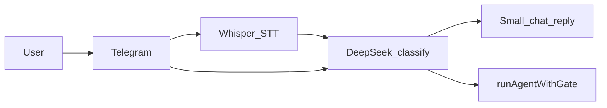

# Conversational text + audio (spec)

## Goals

- Plain-text messages (not starting with `/`) and **voice messages** use the same pipeline as `/agent` when intent is **agent** (same enqueue, poller, and DeepSeek gate as command-based `/agent`).
- **Small talk** uses **DeepSeek** for short replies in **Jarviddin**’s voice (work assistant) when intent is **chat**.
- **Intent classification** and **persona** use **DeepSeek** with `DEEPSEEK_API_KEY` (same key as the existing agent gate).
- **Speech-to-text** uses **OpenAI Whisper** (`OPENAI_API_KEY`). DeepSeek does not transcribe audio; keep this key separate from chat.

## Architecture



1. **Text** or **voice** → optional **Whisper** → unified string.
2. **DeepSeek** `classifyIntent` → `{ "mode": "agent" | "chat", "reply": string | null }`.
   - `chat`: send `reply` (persona embedded in classifier prompt).
   - `agent`: run the same path as `/agent` (`buildCursorAgentPrompt`, gate, enqueue) via `runAgentWithGate`.
3. **Persona** (optional DeepSeek): terminal job messages (`Done` / `Failed`) can be rephrased in Jarviddin’s concise work-assistant tone; **URLs, PR links, and job IDs must stay verbatim**.

## JSON contracts

### Intent (DeepSeek)

```json
{ "mode": "agent" | "chat", "reply": string | null }
```

| `mode`  | `reply` |
| ------- | ------- |
| `chat`  | Required non-empty user-visible string. |
| `agent` | `null` (no separate classifier ack; the gate may still ask questions). |

## Behavior matrix

| Input | `DEEPSEEK_API_KEY` | Behavior |
| ----- | ------------------ | -------- |
| Text  | Set                | DeepSeek classifies → chat reply or `runAgentWithGate`. |
| Text  | Unset              | Use `CONVERSATIONAL_DEFAULT_AGENT`: if `true`, treat as **agent**; if `false`, heuristic (short/greeting → canned chat; coding-like text → **agent**). |
| Voice | `OPENAI_API_KEY` set | Download audio → Whisper → same as text. |
| Voice | `OPENAI_API_KEY` unset | Reply that voice input is not configured; do not enqueue. |
| Whisper failure | Any | Reply with error; do not enqueue. |

## Environment

| Variable | Purpose |
| -------- | ------- |
| `DEEPSEEK_API_KEY` | Intent + small chat + persona + existing agent gate |
| `OPENAI_API_KEY` | Whisper STT only (voice messages); optional — voice disabled if unset |
| `ASSISTANT_SYSTEM_PROMPT` | Optional override for classifier + persona system text |
| `CONVERSATIONAL_DEFAULT_AGENT` | If `true` and DeepSeek is unset, non-command messages default to **agent**; if `false`, default to **chat** heuristic |

## Security and privacy

- Do not log raw audio buffers or full transcripts in production logs.
- If logging is needed for debugging, cap length and avoid raw user content in structured logs.
- Voice is sent to OpenAI for transcription; text is sent to DeepSeek per your deployment policies.

## Implementation checklist

| Area | Location |
| ---- | -------- |
| Config | [`src/config.ts`](../src/config.ts) |
| Whisper | [`src/integrations/whisper.ts`](../src/integrations/whisper.ts) |
| Intent | [`src/llm/intent.ts`](../src/llm/intent.ts) |
| Persona | [`src/llm/persona.ts`](../src/llm/persona.ts) |
| JSON fence helper | [`src/llm/jsonText.ts`](../src/llm/jsonText.ts) |
| Orchestration | [`src/telegram/conversational.ts`](../src/telegram/conversational.ts) |
| Telegram handlers | [`src/telegram/bot.ts`](../src/telegram/bot.ts) |
| Poller notices | [`src/jobs/poller.ts`](../src/jobs/poller.ts) |

## Risks

- **Cost / latency**: With `DEEPSEEK_API_KEY` set, each conversational message triggers classification; optional future shortcuts (length / heuristics) can reduce calls.
- **Double gate**: Intent classification may send the user to `runAgentWithGate`, which may still run `gateAgentLaunch` — same as `/agent`, by design.
