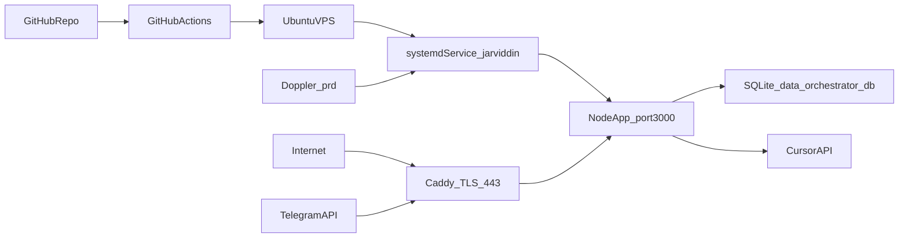

# Ubuntu 24.02 Deployment Plan

## What I validated in your codebase
- Runtime is Node 20+ TypeScript service (`npm run build` -> `dist/index.js`) from [`package.json`](package.json).
- Production script expects Doppler `prd` config (`"start": "doppler run -c prd -- node dist/index.js"`) in [`package.json`](package.json).
- Required production env checks come from [`src/config.ts`](src/config.ts): `TELEGRAM_BOT_TOKEN`, `TELEGRAM_ALLOWED_USER_IDS`, webhook secret in webhook mode, and (when not `LOCAL_DEV`) `CURSOR_API_KEY` + `DEFAULT_GITHUB_REPO`.
- Deployment templates already exist: systemd unit [`deploy/jarviddin.service.example`](deploy/jarviddin.service.example), reverse proxy [`deploy/Caddyfile.example`](deploy/Caddyfile.example), env template [`.env.prd.example`](.env.prd.example), and secret workflow docs [`docs/secrets.md`](docs/secrets.md).

## Target architecture

## Step-by-step execution plan
- **Server bootstrap**
  - Create non-root deploy user, lock SSH to key auth, enable UFW (`22,80,443`).
  - Install required packages: `git`, `curl`, `build-essential`, `caddy`, Node 20 LTS.
- **App directory + code**
  - Use `/opt/jarviddin` as app root and `/opt/jarviddin/data` for SQLite persistence.
  - Clone repo and run `npm ci && npm run build`.
- **Secrets via Doppler (`prd`)**
  - Install Doppler CLI on VPS, authenticate with a server/service token, select project config `prd`.
  - Populate Doppler from [`.env.prd.example`](.env.prd.example) values.
  - Keep webhook mode enabled: `TELEGRAM_USE_POLLING=false` and set `PUBLIC_BASE_URL`.
- **systemd service setup (Doppler-aware)**
  - Start from [`deploy/jarviddin.service.example`](deploy/jarviddin.service.example) but run with Doppler wrapper in `ExecStart` so no plaintext `.env` is needed.
  - Enable restart policy and run service as unprivileged user.
- **Caddy reverse proxy + TLS**
  - Apply [`deploy/Caddyfile.example`](deploy/Caddyfile.example) with your domain -> `localhost:3000`.
  - Validate HTTPS and health endpoint (`/health`).
- **Telegram webhook registration**
  - Register webhook URL `https://<domain>/webhook/telegram` with `secret_token=<TELEGRAM_WEBHOOK_SECRET>` per [`README.md`](README.md).
- **GitHub Actions deployment flow**
  - Add workflow to build/test on push to `main`, then deploy to VPS via SSH (or artifact pull), run `npm ci`, `npm run build`, and `systemctl restart jarviddin`.
  - Store CI secrets in GitHub Encrypted Secrets (SSH private key, VPS host/user, optional Doppler token if needed by pipeline).

## Where to keep VPS credentials (policy)
- **Best place:** GitHub Actions repository/org secrets for CI credentials (`VPS_SSH_KEY`, `VPS_HOST`, `VPS_USER`) and Doppler-managed runtime secrets.
- **On server:** keep only short-lived/least-privilege credentials; prefer Doppler service token with restricted project/config scope.
- **Never store in git:** no real `.env`, no private keys, no tokens in tracked files.
- **Optional local fallback:** password manager (1Password/Bitwarden) for manual operations; not in plaintext notes.

## Acceptance checks
- `systemctl status jarviddin` is healthy after reboot.
- `curl https://<domain>/health` returns `ok`.
- Telegram webhook info shows your URL + pending updates near zero.
- App can launch `/agent` without config validation errors.
